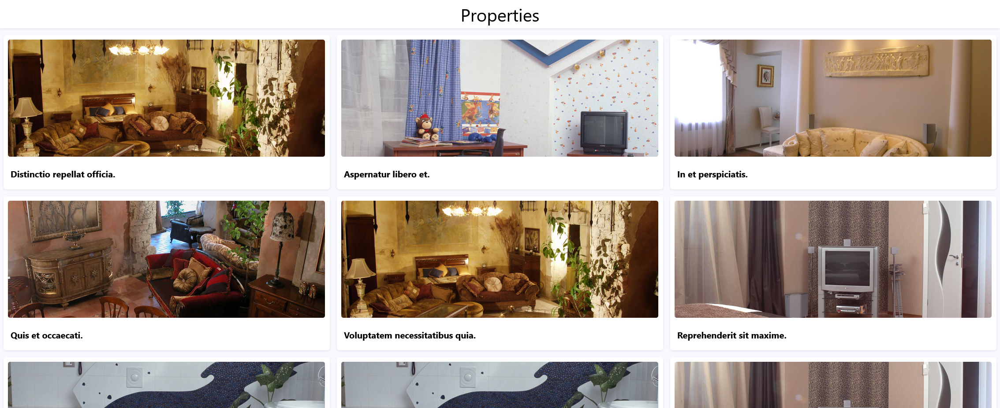

# Realty List

On access you will see 50 properties listed each with a cover photo.

## Built With

- Ruby 3.1.2
- Rails 7.0.4
- Styled with:
  - Bootstrap 5.0
- Tested with:
  - Rspec
  - Capybara
  - shoulda-matchers
  - factory-bot
- Database with:
  - PostgreSQL 13

## Getting Started

To get a local copy up and running follow these simple example steps.

### Prerequisites

- Ruby 3.1.2
- Rails 7.0.4
- Yarn
- PostgreSQL 13

### Setup

- On the top of this repo click on the button named "Clone"
- Copy the HTTP URL or SSH.
- On the terminal type `git clone <copied-value>` where <copied-value> is the value you copied on the previous step.
- On the terminal `cd` to the folder you cloned.

### Install

- Open the file 'database.yml' on the folder 'config'
- On development: and on test: change the values of username: and password: to the username and password of your local postgres server.
- On the terminal type `rails db:create`.
- On the terminal type `rails db:migrate`.
- On the terminal type `rails db:seed`.

### Usage

- On the terminal type `rails s`
- On the browser type `localhost:3000`

### Run tests

- On the terminal `cd` to the folder you just cloned.
- On the terminal type `rspec`.

## Authors

👤 **João Paulo Dias França**

- GitHub: [@jpdf00](https://github.com/jpdf00)
- Twitter: [@jpdf00](https://twitter.com/jpdf00)
- LinkedIn: [João Paulo Dias França](https://www.linkedin.com/in/jpdf00/)

## 🤝 Contributing

Contributions, issues, and feature requests are welcome!

Feel free to check the [issues page](https://github.com/jpdf00/realty-list/issues).

## Show your support

Give a ⭐️ if you like this project!

